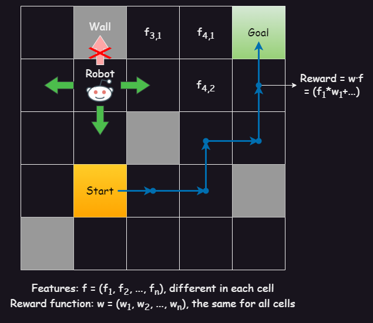
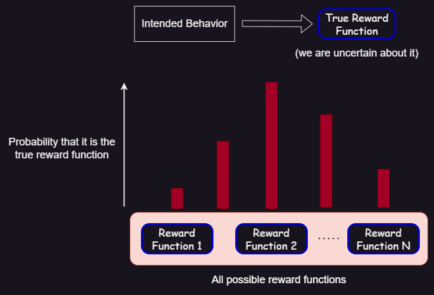
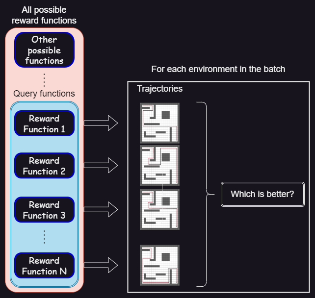
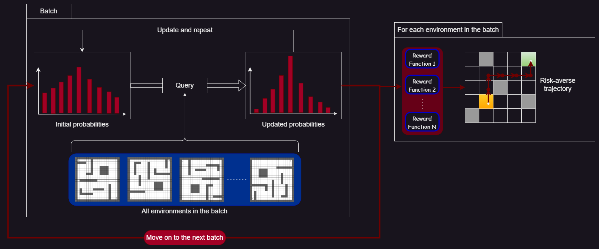

# Risk-averse Batch Active Inverse Reward Design
An improved version of [Inverse Reward Design](https://arxiv.org/abs/1711.02827) and [Active Inverse Reward Design](https://arxiv.org/abs/1809.03060) that computes the probability distribution over the true reward function in batches of test data and computes a risk-averse policy based on it.\
It tries to counteract the problems of goal misgeneralization and reward misspecification, and increase the safety of AI systems, by implementing the ability to learn from real-life environments, not only in training, make the decisions that are most certain using the information it has gained, and learning from the behavior that humans want it to have.\
I used and modified part of [AIRD code](https://github.com/SoerenMind/Inverse_Reward_Design).

# Environment
The environment I used is a *gridworld*, which is a grid with dimensions 12x12, and it contains:
* A *robot*, which can move up, down, right, and left in adjacent cells.
* A *start state*, from which the robot starts moving.
* Some *goal states*, which when the robot reaches it stops moving.
* Some *walls*, from which the robot cannot pass through.
* All the other cells, in which the robot moves.
<table align="center"><tr><td align="center"></td></tr><table>

All the cells contain a vector of *features* $(f_{1}, f_{2}, \ldots, f_{n})$, which are used in calculating the reward in that state.
The *reward* is calculated using a *reward function*, which is a vector of *weights* $(w_{1}, w_{2}, \ldots, w_{n})$, which is the same along all states.\
The reward in a state with features $f=(f_{1}, f_{2},\ldots, f_{n})$ and weights $w=(w_{1}, w_{2}, \ldots, w_{n})$ is their dot product $f \cdot w = (f_{1} \cdot w_{1}+ f_{2} \cdot w_{2}+ \ldots + f_{n}\cdot w_{n})$. We also have a *living reward*, that is used to incentivize shorter routes, so we subtract it from the dot product.\
A *policy* is a map from the states $(x, y)$ to the action ($north, south, east, west$) in the environment. An *agent* controls the robot and moves it in specific directions, using a predetermined *policy*, in order to <b>maximize</b> the total reward in a trajectory of the robot (the *trajectory* is the set of states the robot has visited in chronological order until we stopped it or it reached a goal)

# Probability distribution over the true reward function

<table align="center"><tr><td align="center"></td></tr><table>

In my process, we try to find the reward function that <b>best represents the intended behavior of the agent</b>, which we call the *true reward function*. This function is an element of a big set that is called the *true reward space*, which contains <b>all the possible</b> true reward functions.\
However, because we are unsure of that perfect reward function, in IRD it starts with a human-made estimation which is a *proxy reward function*, which is an element of the *proxy reward space* (in AIRD it only has the proxy reward space).\
The goal of the other papers and my project is to find a *probability distribution* over all the rewards in true reward space: for each element of it, we have the <b>probability that it is the true reward function</b>, based on the behavior they incentivize in the training environment.

# Queries

A *query* is defined as a small subset of the proxy reward space. The *answer* to the query is a single element of that subset, which the human believes incentivizes the best behavior, compared to the other elements of the query (it compares suboptimal behaviors, not the optimal one).
<table align="center"><tr><td align="center"></td></tr><table>

After each query, it uses Bayesian inference to update the probability distribution based on the answer to that query. To do that, it uses a *[Q learning](https://www.datacamp.com/tutorial/introduction-q-learning-beginner-tutorial) planner* that optimizes trajectories, in the training environment, given each element of the query as the reward function. It then computes the feature expectations of these trajectories and uses these and the answer to the query to update the probabilities.
The queries are chosen such that the expected information gain from the answer to the query is maximal. The information gain is measured using various metrics, one of which is the entropy of the probability distribution over the true reward function.

# The process

We are given the true reward space, and a proxy reward space with some proxy reward functions (they may be the same set). We start with setting the wanted probability distribution (for the true reward function) as a uniform distribution (all the functions are equally probable since we don’t know anything about the true reward function).\
There are also some batches, with a specific number of environments in each batch. There is a constant (big) set of test environments for evaluation of the performance.\
I also made two planners, using Q learning, that have as an input a set of weights:
* The *non-risk-averse (unsafe)* one, which has as the reward the average of the rewards on the state with each weight sample.
* The *risk-averse* one, which penalizes the variance of the rewards computed using the weight sample and the state’s features, in two ways:
    * By taking the worst-case reward
    * By subtracting the variance multiplied by a coefficient

<table align="center"><tr><td align="center"></td></tr><table>

For each batch, I do the following:
1.	Repeat (for a constant number of iterations) the query process of AIRD: I find the query from which the information gain of the probability distribution is maximal. The difference with the previous query process is that for each reward function in the query, for each environment in the batch:
    * I take the initial probability distribution.
    * I answer the query to that specific environment.
    * I apply the reward function to the unsafe planner and get the feature expectations.
    * Use the feature expectations to update the probability distribution.
    * Update the initial probability distribution using this inference and move on to the next environment in the batch.
2.	Update the initial probability distribution, so it will be transferred to the next batch.
3.	Sample a set of weights from the distribution over the reward function, and compute a risk-averse policy using the respective planner.